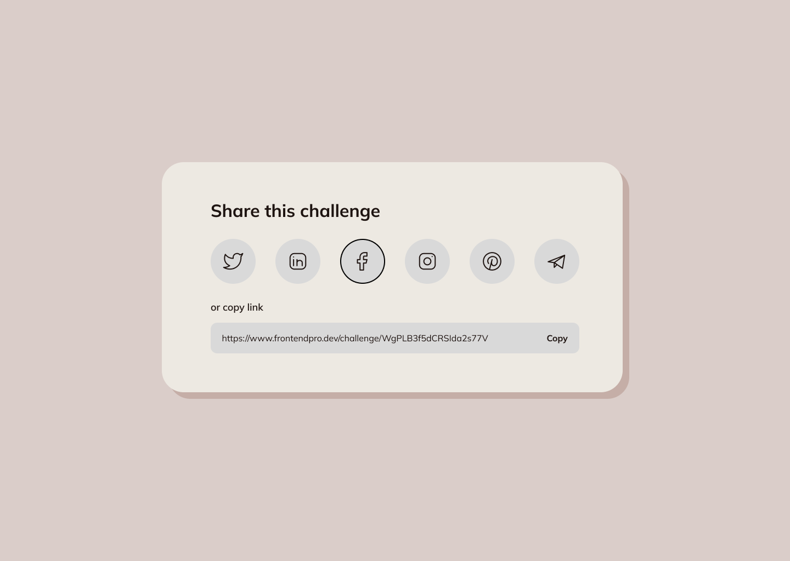

**Project**
Share Content Card Component

**Description**

In this mini frontend project, I gained hands-on experience in building interactive UI components using a combination of CSS and JavaScript. I enhanced my skills in utilizing CSS Flexbox and Grid to create responsive and flexible layouts, ensuring a seamless user experience across different screen sizes. Additionally, I implemented a copy-to-clipboard functionality, which provided users with a smooth and efficient way to copy content with a single click. I also explored using the Web Share API and social media share links to enable seamless content sharing across platforms. This challenge has significantly expanded my front-end development capabilities, allowing me to create dynamic, user-friendly interfaces.

**Functionatilities**

- Users can share content directly on various social media platforms, such as Facebook, Twitter, and Instagram.
- A "Copy" button has been added, allowing users to copy the shared link to their clipboard effortlessly.
- The component is fully responsive and adjusts seamlessly across different screen sizes.

